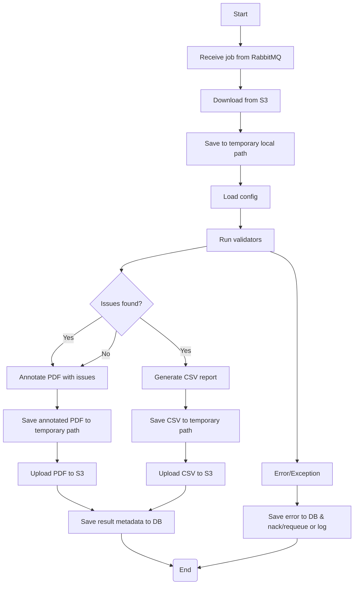

# VUTF Thesis PDF Verification Worker

A RabbitMQ background worker that validates thesis PDF files, produces an annotated PDF and a CSV report, uploads results to S3 or Cloud Storage, and records outcomes in PostgreSQL.

## Features
- Validate document rules: margins, fonts, page/section sequences, indentation, spacing, and paper size
- Annotate PDF with issue highlights and generate CSV reports
- Consume jobs from RabbitMQ; download input from S3 or presigned URLs
- Upload result files to S3 with presigned URLs and save metadata to PostgreSQL

## Workflow (Mermaid)

The diagram below shows the typical worker flow from receiving a job to producing outputs (annotated PDF, CSV, DB record, and S3 presigned URLs):


## Repository structure (important files)
- `main.py` — worker entry point (starts the RabbitMQ consumer)
- `worker/config.py` — environment configuration loader (`.env`)
- `worker/consumer.py` — job processing logic and orchestration
- `worker/s3_client.py` — S3 download/upload helper and key generation
- `worker/database.py` — PostgreSQL client for saving results
- `core/` — PDF validation checks (margin, font, section/page sequence, etc.)
- `config.json` — validation rules and thresholds used by `core/` checks
- `models.py`, `utils.py` — data structures and utility functions

## Requirements
Install dependencies inside a virtual environment. This project uses the requirements file in `thesis_checker/requirements.txt` plus a few additional packages.

Example (Linux/macOS):
```bash
cd thesis_checker
python3 -m venv venv
source venv/bin/activate
pip install -r requirements.txt
pip install pymupdf requests tqdm
```

Windows PowerShell:
```powershell
cd thesis_checker
python -m venv venv
.\venv\Scripts\activate
pip install -r requirements.txt
pip install pymupdf requests tqdm
```

## Configuration
Copy and edit `.env.example` to `.env` and provide your credentials and endpoints:

```env
# AWS S3
AWS_ACCESS_KEY_ID=YOUR_KEY
AWS_SECRET_ACCESS_KEY=YOUR_SECRET
AWS_REGION=ap-southeast-1
S3_BUCKET=your-bucket
S3_ENDPOINT=https://s3.region.amazonaws.com

# RabbitMQ
RABBITMQ_HOST=localhost
RABBITMQ_PORT=5672
RABBITMQ_USER=guest
RABBITMQ_PASSWORD=guest
JOB_QUEUE=pdf_verification_jobs
RESULT_QUEUE=pdf_verification_results

# PostgreSQL
DATABASE_HOST=localhost
DATABASE_PORT=5432
DATABASE_NAME=vutf_db
DATABASE_USER=vutf
DATABASE_PASSWORD=secret
```

The `config.json` file contains validation parameters (margins, fonts, enabled checks). `consumer.py` can temporarily overwrite `config.json` with a per-job `config` payload.

## Run the worker
Start the worker from the `thesis_checker` directory:

```bash
cd thesis_checker
source venv/bin/activate   # Windows: .\venv\Scripts\activate
python main.py
```

The worker will validate configuration on startup and then begin consuming jobs from the configured RabbitMQ queue.

## Job message format
Send a JSON job message to the configured `JOB_QUEUE`. Example:

```json
{
   "job_id": "job-123",
   "submission_id": 987,
   "file_url": "s3://your-bucket/path/to/file.pdf",
   "file_name": "thesis.pdf",
   "attempt": 1,
   "config": { /* optional override for config.json */ },
   "start_time": "2026-04-06T12:00:00Z"
}
```

`file_url` supports either `s3://bucket/key` or an HTTP presigned URL.


